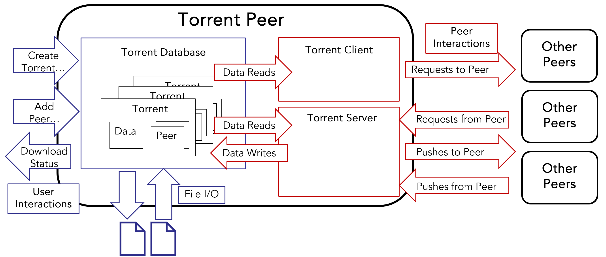
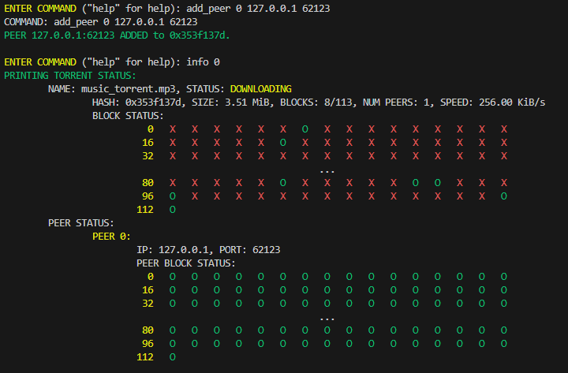
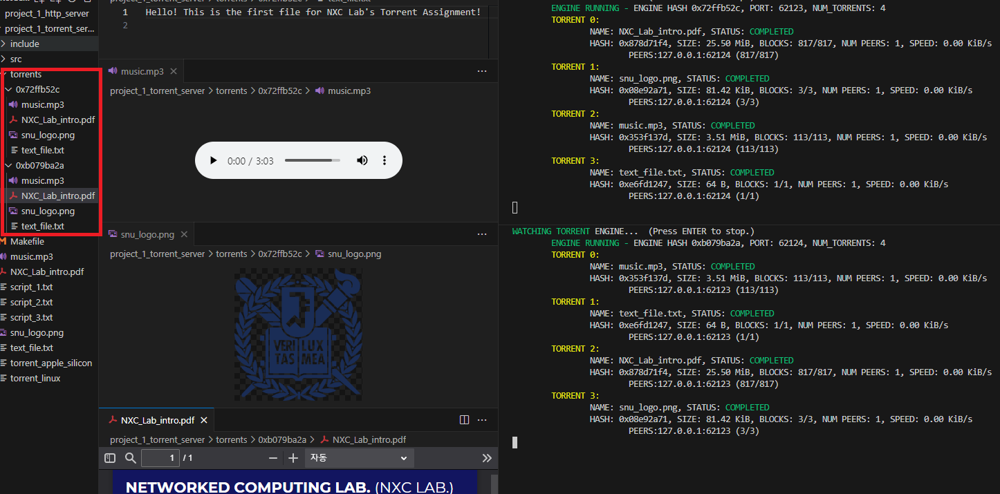

# DCN 2023 Fall Socket Programming Project
Socket programming project created for SNU ECE 2023 Fall **Introduction to Data Communication Networks** class, in which I am the head TA.

Includes three socket applications:

1. Echo server (Tutorial Project)
2. HTTP server (Includes GET, POST, HTTP Authentication)
3. BitTorrent-like P2P file-sharing system
Please refer to the included "[Project 1] Socket Programming.pdf" for project details for the HTTP server and the torrent application.

Last year's project is available at [https://github.com/cakeng/DCN_2022_FALL_Torrent](https://github.com/cakeng/DCN_2022_FALL_Torrent)

Below are some descriptions on the 2. HTTP server and 3. BitTorrent-like P2P file-sharing system projects. A more detailed descriptions are available in the project PDF.

---
# HTTP Server

## Introduction to HTTP server
The Hypertext Transfer Protocol, or HTTP, is used to transfer web page elements such as HTML files or CSS files across the Internet. HTTP clients are usually web browsers, such as Chrome, Firefox, or Safari. HTTP is the protocol that these clients (web browsers) communicate with web servers, such as Apache or NginX to retrieve web pages from the internet. We will use HTTP 1.0 for our project.
HTTP communication is started by the client connecting to the web server using TCP. The port number for HTTP server is usually 80, but in our project, we will be using port 62123, as port 80 is usually blocked by ISPs / OS in many environments. You can specify which IP and port you are connecting to by entering the following URL in your web browser: 
```
http://<IP>:<PORT>/
```
You can run the included TA binary and check out the expected result of your HTTP server, using the following steps. We assume that you have already extracted the project files inside your development environment and have VS code with a terminal open in the development directory. 
1. Grant execution permission on the included binaries.
```
chmod +x ./http_server
```
2. Run the appropriate binary depending on your system.
```
./http_server_<YOUR_SYSTEM> 62123
```
3. Connect to the server by entering http://127.0.0.1:62123/ as the URL on your favorite web browser. You should be greeted with the following web page.


## HTTP Server Program Behavior
Use your web browser to check the behavior of the HTTP server.
1. When you click on the “View Album!” button, it should take you to a web album with 12 images. 
2. If you click on the “Browse” button on the “POST Image” section, you should be able to upload a .jpg image under 1 MB with a filename in English or numbers to the web album. Try it yourself and check the web album to see if it works. 
3. The “Go nowhere!” button will simply return a “404 Not Found” error.
4. The “Authenticate!” button should create a pop-up asking to enter login credentials. Enter DCN for the username and FALL2023 for the password. The page should show a secret image.
If any of the above does not work, please contact the TAs using the Q&A board.

## Implementation Objectives
Your server will 1. create a listening socket and accept incoming connection from web browsers, 2. receive and parse the HTTP request, 3. take appropriate action based on the request, 4. create an HTTP response based on the actions it took, and 5. return the HTTP response back to the web browser. Steps 2 ~ 5 will be repeated indefinitely. 
You only have to modify the “http_engine.c” file for your implementation.
1. Creating a Listening Socket and Accepting Connections\
The function server_engine() in http_engine.c is called by the main function when starting your server. Initialize a TCP socket and bind it to the server_port argument. Inside an infinite loop, accept incoming connections and serve the connections using the server_routine () function.

2. Receiving and Parsing HTTP Requests\
Inside the server_routine function, a header_buffer character array and an infinite loop is presented. Receive the HTTP header inside the loop, until 1. an end of header delimiter is received (i.e., \r\n\r\n) 2. An error occurs or the client disconnects, or 3. the header message from the client is too long.
After receiving the header successfully, you will have to parse the message to know what the client is requesting. That is, you must extract the method, URL, and header field name & header field value tuples from the received header string. 
We recommend you implement the parse_http_header () function, which converts the header string into a http_t struct. http_t struct is a C struct that we created to help you easily manage and manipulate various HTTP elements, using the various helper functions provided in the http_util.c. However, implementing parse_http_header () is NOT necessary, and you can parse the header in any way you like.

3. Take appropriate action\
The requests from the web browser will be either a GET or a POST method. GET methods are used to retrieve web page elements, such as HTML files or CSS files from the web server. POST methods are used to upload data from the client to the HTTP server, such as user images.
On a GET method, you must return the file requested by the URL as the HTTP response. The body of the GET method HTTP request will be empty. 
On a POST method, you must retrieve the file from the HTTP request’s body, save it as a file in the server, and update the HTML file to correctly display the newly uploaded file in the web album.
The cases that you must support for the expected server functionalities are documented in the http_engine.c as comments. Please refer to them for details.
(Uploading using GET will not be covered by this project.)

4. Creating HTTP responses\
Depending on the client request, and the actions you took, there will be different HTTP responses that should be sent back to your web browser. Again, using the included http_t struct and the helper functions will make things much easier for you. You simply have to initialize a response with the init_http_with_arg () function with the appropriate response code and append the right header fields and body to the response.
An example of using the http_t struct and its functions to create an HTTP response is included in the http_engine.c file, on sending a “431 Header too large” response.

5. Returning the HTTP response\
When your HTTP response is ready, you must send the response back to your client. The response message must be formatted according to the HTTP protocol standards, following a similar structure to an HTTP request message, but with a status line instead of a request line.
Fortunately, we have implemented the formatting and sending of the HTTP response for you. It will automatically format an http_t struct into a correct HTTP response message and send it back to your web browser. Checking out the write_http_to_buffer () function may help you better understand the formatting of an HTTP response message and may also help you implement the parse_http_header () function.

---

# BitTorrent-like P2P file-sharing system
## Introduction to BitTorrent-like P2P file-sharing system
BitTorrent is a great example of a Peer-to-Peer networking application. Compared to the traditional server-client-based file exchange, it allows faster file sharing and better scalability of the system through distributed networking. For our torrent application, we will use the above program structure. You will implement the red elements.

The message exchanges in our torrent application will have the following order.
1. The torrent client finds that a torrent needs a certain torrent element to be updated from a remote peer and sends a request message for that element to the remote peer.
2. The server client of the remote peer receives the request message, handles the request message, and responds with a matching push message that contains the requested torrent element.
3. The server client of the requesting peer receives the push message from the remote peer, handles the push message, and updates the torrent database to save the pushed torrent element.
You can run the included TA binary and check out the expected result of your application, using the following steps.

We assume that you have already extracted the project files inside your development environment and have VS code with a terminal open in the development directory. 
1. Grant execution permission on the included binaries.
```
chmod +x ./torrent*
```
3. Run the appropriate binary depending on your system.
```
./torrent_<YOUR_SYSTEM> 62123
```

Use help to see the supported commands. For example, entering “create music_torrent.mp3 music.mp3” will create a torrent from the included music file.
Entering “status” will show the torrents in the database and their download status.
Entering “info <IDX>” will show the detailed information of the torrent with index <IDX>.
To add a torrent based on hash, open another terminal using the “+’ button on the VS code and run another torrent peer with a different port number.
Enter “add <HASH>” to add torrent based on hash. Running the “status” command will return that it has no information on the torrent.
 
Add peer using “add_peer <IDX> <IP> <PORT>”. Adding the original peer will make the application automatically retrieve the torrent info and start downloading.
You can use “watch <IDX>” to watch the automatically refreshed printing of torrent info. You can also use “watch” without an index to watch the automatically refreshed printing of the database status. To exit the watch mode, press enter.



## Torrent Application Behavior
We have included scripts to automatically test the behavior of our application. Open two terminals, and enter “cat ./script_1.txt - | ./torrent_linux 62123” on one terminal, and “cat ./script_2.txt - | ./torrent_linux 62124” on the other. The two peers should automatically enter watch mode, with 4 torrents each, and exchange the file with one another.
After all files are downloaded by the torrents, enter the “torrents” directory. Under the hash name directory of each engine, check if any of the downloaded files are broken.
NOTE: The PDF file may look broken if viewed inside VS code. If so, please check it again using an external PDF reader.
If any of the above does not work, please contact the TAs using the Q&A board.



## Implementation Objective 

You will have to implement three socket functions (listen, accept, connect), the client function, the server function, the four request functions, the four post functions, and the eight handler functions for handling each of the request and post messages.
1. The listen function will open a listen port that the server function will use to receive incoming connections from a remote peer. The accept function will be used by the server function to accept the incoming connections, and the connect function will be used by the four request functions and the four post functions to connect to the server function of the remote peer. The accept and the connect function must support a timeout in case the remote peers are unresponsive.
2. The client function will iterate through the torrents in the database and send request messages to remote peers, using the four request functions each corresponding to the four torrent elements. For every torrent in the database, it will iterate through all peers of the torrent and send four different request messages for torrent elements.
    1.	If the torrent is missing torrent info, it will request torrent info with a certain time interval.
    2.	If the torrent info exists, it will request the known peer list of the peer with a certain time interval.
    3.	If the torrent info exists, it will request the block status of the peer with a certain time interval.
    4.	If the torrent info exists, it will randomly select a block data that is missing from itself but exists on the peer, and request it to the peer with a certain time interval.
3. The server function will use the accept socket functions to receive messages from remote peers. It will parse the common arguments of the messages, to check what kind of message it is (message command), which peer it is from (peer’s engine hash), which port the peer is listening on (peer’s listening port), and which torrent the message is targeting (torrent hash). It will then hand the remaining portions of the message by to the eight handler functions each corresponding to the eight types of the messages.
4. The four handler functions for request messages will receive the torrent element data request from the four different request messages from a remote peer. It will check if the message is valid and respond by sending a post message to the requesting peer, using the four post functions each corresponding to the four torrent elements.
5. The four handler functions for post messages will receive the torrent element data contained in the four different post messages from a remote peer. It will check if the message is valid and update the torrent database with the received torrent element data.
6. The four request functions and the four post functions will use the connect socket functions to connect to the server function of the remote peer and send either a request or a post message with the appropriate message protocol.
Request, push, and the two handler functions for the torrent info torrent element are already implemented for you to serve as an example of how to handle and format the messages. You only have to modify the “torrent_engine.c” file for your implementation.


