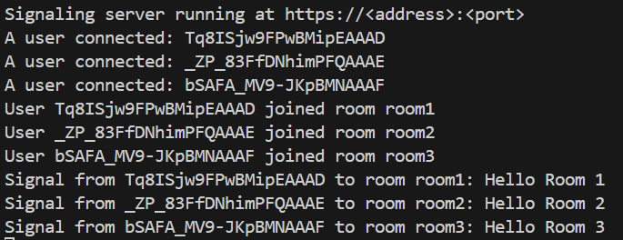
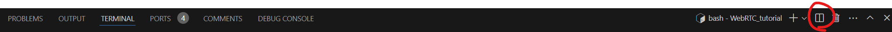
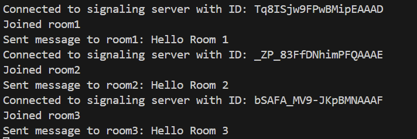
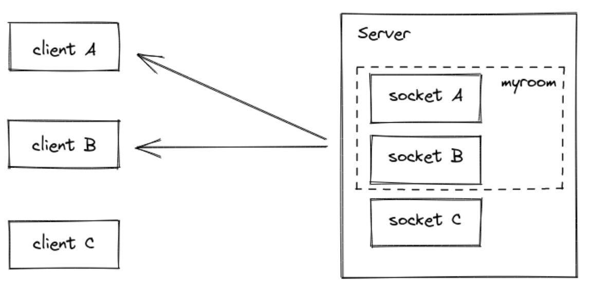

# Project #1: Signaling Server (1 point)

This project requires running a signaling server `server.js`.

## Directory Structure
```bash
project1/
│
├── src/                    # Source code directory
│   ├── server.js           # signaling server source code
│   ├── server.js           # signaling server test code
├── package.json            # Files for installing and running javascript library
├── README.md               # this file!
```

## `server.js` Overview
This .js file will execute the signaling server with allowed ports (9001:9014)

### Basics Setting
1. An signaling server is created using Express, and CORS is enabled to allow requests from the specified origin.
- You need to change the origin value to your web server's `<address>:<port>`.
```js
const app = express();
const server = http.createServer(app);

app.use(cors());

// TO DO: change origin url to your frontend server's url
const io = socketIo(server, {
  cors: {
    origin: "http://<address>:<port>",  // Hint: change this to your server's url
    methods: ["GET", "POST"]
  }
});
```
2. Your signaling server will use the allowed ports (9001:9014). please change the listening ports (80) to your server's port  (e.g., webrtc001 -> 9001)
```js
server.listen(80, '0.0.0.0', () => {
  console.log('Signaling server running at https://<address>:<port>'); // Hint: change this to your signaling server's url
});
```
## Instruction
### Deliverables
- You will implement a signaling server using functions (methods) provided by the `Socket.IO` library.
- All parts that need to be developed are marked TO DO.

### Debugging
1. If you want to execute signaling server, change the directory to `project_1` and enter `npm start`



2. If you want to test the signaling server, create another terminal and enter `npm test`


3. If the test is successful, the following screen appears:



## The functions (methods) to be used 

### `Socket.IO` Methods
#### 1. `socket.join()`
The `socket.join()` method is used to add the socket to a room. Rooms are a way to group sockets so that you can broadcast messages to multiple clients easily.



```js
socket.join(room);
```
- `roomName`: The name of the room to join. If the room does not exist, it will be created.

#### 2. `socket.on()`
The `socket.on()` method is used to register an *event listener*. When the specified event is received, the provided callback function will be executed.
```js
socket.on(eventName, callback);
```
- `eventName`: The name of the event to listen for.
- `callback`: The function to execute when the event is received. This function typically takes one or more parameters, depending on the event.

#### 3. `socket.emit()`
The `socket.emit()` method is used to send an event to the server or to all clients connected to the server (when used on the server side).
```js
socket.emit(eventName, ...args);
```
- `eventName`: The name of the event to send.
- `...args`: The data to send with the event. This can be any number of arguments, depending on what the event handler expects.

#### 4. `socket.to()`
The `socket.to()` method is used to broadcast an event to all clients in a specific room, except the sender.
```js
socket.to(room).emit(eventName, ...args);
```
- `roomName`: The name of the room to which the message should be sent.
- `eventName`: The name of the event to send.
- `...args`: The data to send with the event.
